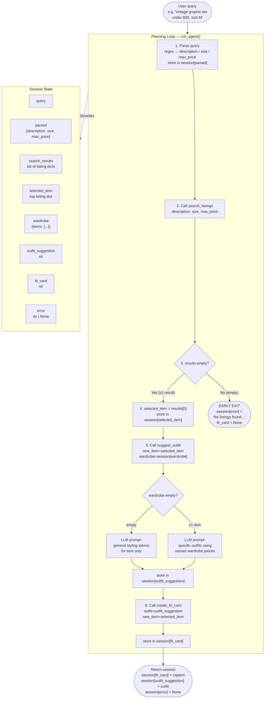

# FitFindr — planning.md

> Complete this document before writing any implementation code.
> Your spec and agent diagram are what you'll use to direct AI tools (Claude, Copilot, etc.) to generate your implementation — the more specific they are, the more useful the generated code will be.
> Your planning.md will be reviewed as part of your submission.
> Update it before starting any stretch features.

---

## Tools

List every tool your agent will use. For each tool, fill in all four fields.
You must have at least 3 tools. The three required tools are listed — add any additional tools below them.

### Tool 1: search_listings

**What it does:**
Searches the mock listings dataset (`data/listings.json`) for thrift items matching a
natural-language description, an optional size filter, and an optional price ceiling.
It scores each candidate by keyword overlap and returns results sorted best-match first.

**Input parameters:**
- `description` (str): Natural-language keywords describing the item the user wants
  (e.g., `"vintage graphic tee"`, `"baggy cargo pants"`). Used to score each listing
  by counting token matches against `title`, `description`, and `style_tags`.
- `size` (str | None): Size string to filter by. Matching is case-insensitive substring:
  `"M"` matches `"S/M"`, `"M"`, and `"XL (oversized)"` does NOT match `"M"`.
  Pass `None` to skip size filtering entirely.
- `max_price` (float | None): Maximum price in USD, inclusive (price ≤ max_price).
  Pass `None` to skip price filtering entirely.

**What it returns:**
A `list[dict]` of matching listing dicts, sorted by relevance score descending
(highest-scoring item at index 0). Returns an **empty list** if no listings survive
filtering and scoring — it never raises an exception.

Each dict in the list has exactly these fields (sourced directly from `listings.json`):
```
{
  "id":         str,         # e.g. "lst_002"
  "title":      str,         # e.g. "Y2K Baby Tee — Butterfly Print"
  "description": str,        # free-text condition notes
  "category":   str,         # one of: tops, bottoms, outerwear, shoes, accessories
  "style_tags": list[str],   # e.g. ["y2k", "vintage", "graphic tee"]
  "size":       str,         # e.g. "S/M", "M", "W30 L30"
  "condition":  str,         # excellent | good | fair
  "price":      float,       # e.g. 18.0
  "colors":     list[str],   # e.g. ["white", "pink", "purple"]
  "brand":      str | None,  # e.g. "Levi's" or null
  "platform":   str          # depop | thredUp | poshmark
}
```

**What happens if it fails or returns nothing:**
The function itself always returns a list (possibly empty) — it never raises.
The **planning loop** checks `len(session["search_results"]) == 0` immediately after
the call. If empty, it sets:
```python
session["error"] = (
    f"No listings found for '{session['parsed']['description']}'"
    + (f" in size {session['parsed']['size']}" if session['parsed'].get('size') else "")
    + (f" under ${session['parsed']['max_price']:.0f}" if session['parsed'].get('max_price') else "")
    + ". Try broadening your search — remove the size filter or raise your price limit."
)
```
and returns the session immediately without calling `suggest_outfit` or `create_fit_card`.

---

### Tool 2: suggest_outfit

**What it does:**
Calls the Groq LLM to suggest 1–2 complete, specific outfits pairing the thrifted
`new_item` with pieces from the user's `wardrobe`. If the wardrobe is empty it falls
back to general styling advice rather than crashing or returning an empty string.

**Input parameters:**
- `new_item` (dict): A full listing dict as returned by `search_listings` — the item
  the user is considering buying. The tool uses `title`, `category`, `style_tags`,
  `colors`, `price`, and `platform` to build the LLM prompt.
- `wardrobe` (dict): A wardrobe dict with an `"items"` key whose value is a
  `list[dict]`. Each wardrobe item dict has: `id` (str), `name` (str), `category`
  (str), `colors` (list[str]), `style_tags` (list[str]), `notes` (str | None).
  An empty wardrobe looks like `{"items": []}`.

**What it returns:**
A non-empty `str` containing outfit suggestions from the LLM. The string will be one
of two forms:

- **Wardrobe present (≥1 item):** 1–2 named outfit combinations that reference
  specific wardrobe pieces by their `name` field. Example:
  > "Outfit 1: Pair the butterfly baby tee with your baggy dark-wash jeans and
  >  chunky white sneakers for a Y2K street look. Add the black crossbody bag
  >  to finish. Outfit 2: Tuck it into the wide-leg khaki trousers with black
  >  combat boots for a softer cottagecore vibe."

- **Empty wardrobe:** General styling advice without referencing specific owned pieces.
  Example:
  > "This Y2K butterfly tee leans cottagecore-meets-streetwear. It pairs well with
  >  high-waisted wide-leg denim, plaid mini skirts, or cargo pants. For shoes,
  >  try chunky sneakers or Mary Janes. Keep accessories minimal — a simple
  >  shoulder bag or small hoop earrings work great."

This function never returns an empty string and never raises an exception.

**What happens if it fails or returns nothing:**
If `wardrobe["items"]` is an empty list, the function follows the **general styling
advice path**: it builds a prompt that describes only the new item and asks the LLM
for what styles, silhouettes, and shoe types pair well with it. The returned string
always begins with the item's title so the caller can confirm it processed the right item.

---

### Tool 3: create_fit_card

**What it does:**
Calls the Groq LLM at a **higher temperature (0.9)** to generate a 2–4 sentence
Instagram/TikTok-style OOTD caption for the thrifted find. The caption is casual,
specific, and sounds like a real post rather than a product description.

**Input parameters:**
- `outfit` (str): The full outfit-suggestion string returned by `suggest_outfit`.
  Used to give the LLM the styling context so the caption references the actual look.
- `new_item` (dict): The full listing dict for the thrifted item. The tool uses
  `title` (str), `price` (float), and `platform` (str) to ensure those three details
  appear naturally in the caption.

**What it returns:**
A `str` of 2–4 sentences formatted as a social-media caption. The string will:
- Mention `new_item["title"]` (or a shortened version of it) exactly once.
- Mention `new_item["price"]` formatted as `$XX` exactly once.
- Mention `new_item["platform"]` (e.g., "Depop") exactly once.
- Capture the outfit vibe using specific adjectives drawn from the outfit suggestion.
- Sound different across different inputs (high temperature ensures variation).

Example return value:
> "Found this Y2K Butterfly Baby Tee on Depop for $18 and I genuinely cannot stop
>  wearing it. Paired it with baggy dark-wash jeans and chunky sneakers and the
>  early-2000s energy is immaculate. Thrift finds that hit this hard are why I'll
>  never pay full price."

If `outfit` is an empty or whitespace-only string, returns this error string without
raising:
> `"Could not generate fit card: outfit description is missing. Ensure suggest_outfit ran successfully first."`

**What happens if it fails or returns nothing:**
Guard at the top of the function:
```python
if not outfit or not outfit.strip():
    return "Could not generate fit card: outfit description is missing. Ensure suggest_outfit ran successfully first."
```
No exception is raised in any path.

---

### Additional Tools (if any)

None required beyond the three above.

---

## Planning Loop

**How does your agent decide which tool to call next?**

The planning loop in `run_agent()` executes a **fixed linear sequence** with one
conditional early-exit after Tool 1. There is no LLM driving the loop itself —
each step fires unconditionally as long as the previous step succeeded.

```
1. PARSE the query
   ─ Use regex to extract:
       max_price: re.search(r'under \$?(\d+(?:\.\d+)?)', query, re.IGNORECASE)
                  → group(1) as float, or None if no match
       size:      re.search(r'\b(XXS|XS|S/M|S|M|L|XL|XXL|W\d+.*|one[- ]size)\b',
                            query, re.IGNORECASE)
                  → group(0) as str, or None
       description: query with price/size tokens stripped, lowercased, whitespace-collapsed
   ─ Store in session["parsed"] = {"description": ..., "size": ..., "max_price": ...}

2. CALL search_listings(
       description=session["parsed"]["description"],
       size=session["parsed"]["size"],
       max_price=session["parsed"]["max_price"]
   )
   ─ Store result in session["search_results"]
   ─ CHECK: if len(session["search_results"]) == 0:
         session["error"] = (actionable message — see Tool 1 failure section)
         return session   ← EARLY EXIT; do not proceed

3. SELECT top result
   ─ session["selected_item"] = session["search_results"][0]

4. CALL suggest_outfit(
       new_item=session["selected_item"],
       wardrobe=session["wardrobe"]
   )
   ─ Store result in session["outfit_suggestion"]
   ─ (No early exit here — suggest_outfit always returns a non-empty string)

5. CALL create_fit_card(
       outfit=session["outfit_suggestion"],
       new_item=session["selected_item"]
   )
   ─ Store result in session["fit_card"]

6. RETURN session
   ─ session["error"] is None; session["fit_card"] and session["outfit_suggestion"]
     are both non-None strings.
```

The loop knows it is done when `create_fit_card` returns. There is no iteration —
each tool is called exactly once per `run_agent()` invocation.

---

## State Management

**How does information from one tool get passed to the next?**

All state lives in the `session` dict created by `_new_session()`. Nothing is stored
in module-level globals or passed directly between tool functions — every tool receives
only the data it needs, pulled from `session` by the planning loop.

| session key | Type | Set by | Read by |
|---|---|---|---|
| `query` | str | `_new_session()` | parse step (loop) |
| `parsed` | dict {description, size, max_price} | parse step (loop) | `search_listings` call + error message |
| `search_results` | list[dict] | loop after Tool 1 | loop (empty check + select top) |
| `selected_item` | dict | loop after empty check | `suggest_outfit`, `create_fit_card` |
| `wardrobe` | dict | `_new_session()` | `suggest_outfit` |
| `outfit_suggestion` | str | loop after Tool 2 | `create_fit_card` |
| `fit_card` | str | loop after Tool 3 | caller of `run_agent()` |
| `error` | str \| None | loop on early exit | caller of `run_agent()` |

The wardrobe dict is passed into `run_agent()` by the caller (e.g., `app.py` or the
CLI harness in `agent.py`) and stored unchanged in `session["wardrobe"]`. It is
never mutated. `suggest_outfit` receives it as an argument directly from the session.

---

## Error Handling

For each tool, describe the specific failure mode you're handling and what the agent does in response.

| Tool | Failure mode | Agent response |
|------|-------------|----------------|
| search_listings | No listings match description + size + max_price filters | Sets `session["error"]` to: `"No listings found for 'vintage graphic tee' in size M under $30. Try broadening your search — remove the size filter or raise your price limit."` (slots filled dynamically from `session["parsed"]`). Returns session immediately; `fit_card` and `outfit_suggestion` remain `None`. |
| suggest_outfit | `wardrobe["items"]` is an empty list | The tool itself handles this gracefully: it sends a different LLM prompt asking for general styling advice (e.g., what silhouettes and shoe types pair with the item) rather than specific wardrobe combos. Returns a non-empty string starting with the item title. The planning loop continues normally — this is not treated as an error. |
| create_fit_card | `outfit` argument is empty or whitespace-only | Returns the string: `"Could not generate fit card: outfit description is missing. Ensure suggest_outfit ran successfully first."` Does not raise. The planning loop stores this string in `session["fit_card"]`; the caller can detect it by checking for the `"Could not generate"` prefix. |

---

## Architecture



---

## AI Tool Plan

<!-- For each part of the implementation below, describe:
     - Which AI tool you plan to use (Claude, Copilot, ChatGPT, etc.)
     - What you'll give it as input (which sections of this planning.md, your agent diagram)
     - What you expect it to produce
     - How you'll verify the output matches your spec before running it

     "I'll use AI to help me code" is not a plan.
     "I'll give Claude my Tool 1 spec (inputs, return value, failure mode) and ask it to implement
     search_listings() using load_listings() from the data loader — then test it against 3 queries
     before trusting it" is a plan. -->

**Tool:** Claude Code with Sonnet 4.6 for all milestones.

---

**Milestone 3 — Individual tool implementations:**

**Tool 1 — `search_listings`:**

Prompt input: the Tool 1 spec from this file (What it does, all three parameter
descriptions including the size-substring-matching rule, the exact return dict fields,
the empty-list guarantee, and the failure-mode text). Also include the `load_listings()`
docstring from `utils/data_loader.py` and one sample listing from `listings.json` to
anchor the field names.

Expected output: A complete implementation of `search_listings()` in `tools.py` that:
1. Calls `load_listings()`, filters by `max_price` and `size` (case-insensitive
   substring), scores remaining items by token overlap against `description` (split on
   whitespace/punctuation), drops zero-score items, sorts descending, and returns the
   list.

Verification before trusting:
1. Call `search_listings("vintage graphic tee", None, 30.0)` — assert result is
   non-empty and every returned item has `price ≤ 30.0` and at least one of
   "vintage", "graphic", or "tee" in title/description/style_tags.
2. Call `search_listings("jeans", "M", None)` — assert every returned item's `size`
   field contains "M" (case-insensitive).
3. Call `search_listings("designer ballgown", None, 5.0)` — assert result is `[]`.
4. Confirm the top result for query 1 is `lst_002` (Y2K Baby Tee) by checking its `id`.

---

**Tool 2 — `suggest_outfit`:**

Prompt input: the Tool 2 spec from this file (both branches: wardrobe present vs.
empty; return string format; the guarantee that it never returns empty string or
raises). Also include the `wardrobe_schema.json` item structure and the
`_get_groq_client()` helper already present in `tools.py`.

Expected output: A complete `suggest_outfit()` that:
1. Checks `len(wardrobe["items"]) == 0` and branches accordingly.
2. Builds a clear LLM prompt that enumerates the wardrobe items by name when present.
3. Calls `Groq` via `_get_groq_client()` and returns the response text.

Verification before trusting:
1. Call with `new_item = search_listings("vintage graphic tee", None, 30.0)[0]` and
   `wardrobe = get_example_wardrobe()`. Assert the returned string is non-empty and
   contains at least one wardrobe item name (e.g., "baggy" or "jeans" or "sneakers").
2. Call with the same `new_item` and `wardrobe = get_empty_wardrobe()`. Assert the
   returned string is non-empty and does NOT reference specific wardrobe-item names
   (since none exist).
3. Assert neither call raises an exception.

---

**Tool 3 — `create_fit_card`:**

Prompt input: the Tool 3 spec from this file (2–4 sentence constraint; must mention
item title, price, and platform once each; higher temperature = 0.9; casual OOTD
tone; empty-outfit guard returning the exact error string specified). Include the
example return value from the spec as a style target.

Expected output: A complete `create_fit_card()` that:
1. Guards against empty `outfit` and returns the specified error string.
2. Builds a prompt with item details and outfit context, specifying the caption style.
3. Calls Groq with `temperature=0.9` and returns the response text.

Verification before trusting:
1. Call with a non-empty outfit string and the `lst_002` dict. Assert output is 2–4
   sentences (split on `. ` or `! ` and count ≥ 2, ≤ 4). Assert `"$18"` and
   `"Depop"` each appear in the output.
2. Call with `outfit=""` and any item dict. Assert the exact error string is returned
   (starts with `"Could not generate fit card"`).
3. Call twice with the same inputs and verify the two outputs differ (high temperature
   should produce variation — manual inspection acceptable here).

---

**Milestone 4 — Planning loop and state management:**

Prompt input: the Planning Loop section of this file (the full numbered pseudocode
block), the State Management table, and the Mermaid architecture diagram. Also include
the `_new_session()` function signature from `agent.py` and the three tool import lines.

Expected output: A complete `run_agent()` implementation in `agent.py` that:
1. Calls `_new_session()`.
2. Parses the query with the two regex patterns specified in the Planning Loop section.
3. Calls `search_listings`, checks for empty results, and sets `session["error"]` +
   returns early if empty.
4. Sets `session["selected_item"] = session["search_results"][0]`.
5. Calls `suggest_outfit` and `create_fit_card`, storing results in session.
6. Returns the session dict.

Verification before trusting:
1. Run `python agent.py` and confirm the "Happy path" block prints a non-None
   `fit_card` and non-None `outfit_suggestion`, with `session["error"] == None`.
2. Confirm the "No-results path" block prints a non-None `session["error"]` string
   containing "No listings found" and that `session["fit_card"]` is `None`.
3. Read the generated code and confirm the regex for `max_price` and `size` matches
   the exact patterns in the Planning Loop spec before running it.

---

## A Complete Interaction (Step by Step)

Write out what a full user interaction looks like from start to finish — tool call by tool call. Use a specific example query.

**Example user query:** "I'm looking for a vintage graphic tee under $30. I mostly wear baggy jeans and chunky sneakers. What's out there and how would I style it?"

**Step 1: Parse the query**

The planning loop runs regex over the query string:
- `re.search(r'under \$?(\d+)', query)` → captures `"30"` → `max_price = 30.0`
- `re.search(r'\b(XXS|XS|S/M|S|M|L|XL|XXL|W\d+.*)\b', query)` → no match → `size = None`
- Description after stripping the price token: `"vintage graphic tee"`

`session["parsed"] = {"description": "vintage graphic tee", "size": None, "max_price": 30.0}`

**Step 2: Call search_listings**

```python
search_listings(description="vintage graphic tee", size=None, max_price=30.0)
```

- `load_listings()` returns all listings.
- Price filter: keeps only items with `price ≤ 30.0`.
- Keyword scoring: tokenizes description → `{"vintage", "graphic", "tee"}`. Scores each
  remaining listing by counting token hits across `title + description + style_tags`.
- `lst_002` (Y2K Baby Tee — Butterfly Print, $18, style_tags: ["y2k", "vintage", "graphic tee"]):
  score = 3 hits ("vintage" in tags, "graphic tee" in tags [counts as 2 tokens], "tee"
  in title implicitly). Highest score.
- Returns `[{...lst_002...}, {...lst_003...}, ...]` (sorted by score, all ≤ $30).
- `len(results) > 0` → no early exit.
- `session["search_results"] = [...]`
- `session["selected_item"] = lst_002 dict`

**Step 3: Call suggest_outfit**

```python
suggest_outfit(
    new_item={"id": "lst_002", "title": "Y2K Baby Tee — Butterfly Print",
              "category": "tops", "style_tags": ["y2k", "vintage", "graphic tee", "cottagecore"],
              "colors": ["white", "pink", "purple"], "price": 18.0, "platform": "depop", ...},
    wardrobe={"items": [
        {"name": "Baggy straight-leg jeans, dark wash", "category": "bottoms", ...},
        {"name": "Chunky white sneakers", "category": "shoes", ...},
        ... (8 more items)
    ]}
)
```

- `wardrobe["items"]` has 10 items → not empty → specific outfit path.
- LLM prompt: lists all 10 wardrobe items by name and asks for 1–2 outfit combos
  featuring the Y2K Baby Tee.
- LLM returns:
  > "Outfit 1: Pair the Y2K Butterfly Baby Tee with your Baggy straight-leg jeans
  >  (dark wash) and Chunky white sneakers for a nostalgic Y2K streetwear look —
  >  add the Black crossbody bag to keep it clean. Outfit 2: Tuck it into your
  >  Wide-leg khaki trousers with Black combat boots for a softer, more eclectic
  >  cottagecore-street blend."
- `session["outfit_suggestion"]` = (above string)

**Step 4: Call create_fit_card**

```python
create_fit_card(
    outfit="Outfit 1: Pair the Y2K Butterfly Baby Tee with your Baggy straight-leg jeans...",
    new_item={"title": "Y2K Baby Tee — Butterfly Print", "price": 18.0, "platform": "depop", ...}
)
```

- `outfit` is non-empty → proceed.
- LLM prompt: provides item title, price ($18), platform (Depop), and the outfit
  description; asks for a 2–4 sentence casual OOTD caption; temperature = 0.9.
- LLM returns:
  > "Snagged this Y2K Butterfly Baby Tee on Depop for $18 and it's genuinely one of
  >  my best finds. Threw it on with baggy dark-wash jeans and chunky white sneakers
  >  and the early 2000s energy was just there. Thrifting really does hit different
  >  when the fit comes together this effortlessly."
- `session["fit_card"]` = (above string)

**Final output to user:**

The caller (e.g., `app.py`) reads `session["outfit_suggestion"]` and `session["fit_card"]`
and displays them. `session["error"]` is `None`. The user sees:

---
**We found it:** Y2K Baby Tee — Butterfly Print — $18 on Depop (size S/M, excellent condition)

**How to style it:**
Outfit 1: Pair the Y2K Butterfly Baby Tee with your Baggy straight-leg jeans (dark wash) and Chunky white sneakers for a nostalgic Y2K streetwear look — add the Black crossbody bag to keep it clean. Outfit 2: Tuck it into your Wide-leg khaki trousers with Black combat boots for a softer, more eclectic cottagecore-street blend.

**Your fit card:**
Snagged this Y2K Butterfly Baby Tee on Depop for $18 and it's genuinely one of my best finds. Threw it on with baggy dark-wash jeans and chunky white sneakers and the early 2000s energy was just there. Thrifting really does hit different when the fit comes together this effortlessly.

---
